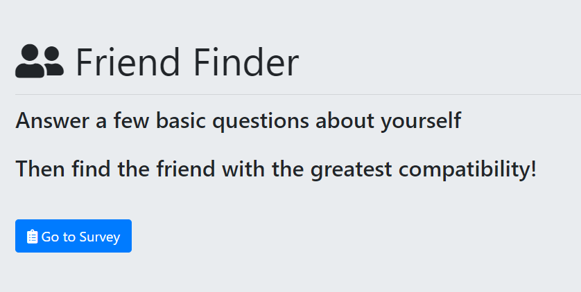
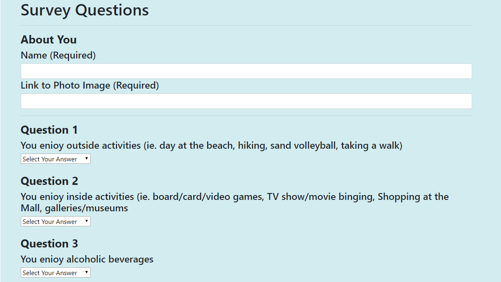

# Friend-Finder
A compatibility-based "FriendFinder" application -- dating app style! This full-stack site takes in results from the users' survey, then compares their answers with those from other 'users'. The app will then display the name and picture of the user with the best overall match. Using Express to handle routing, jQuery to fill the pages information, and deployed on Heroku

